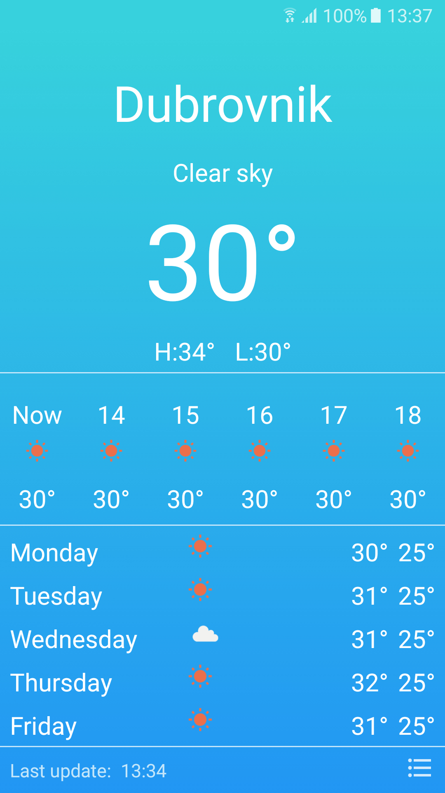
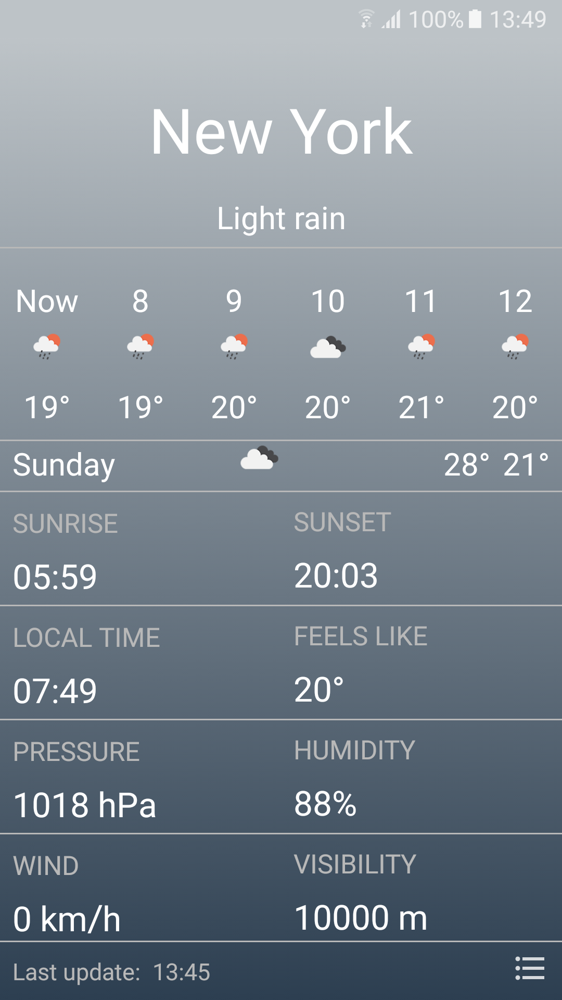
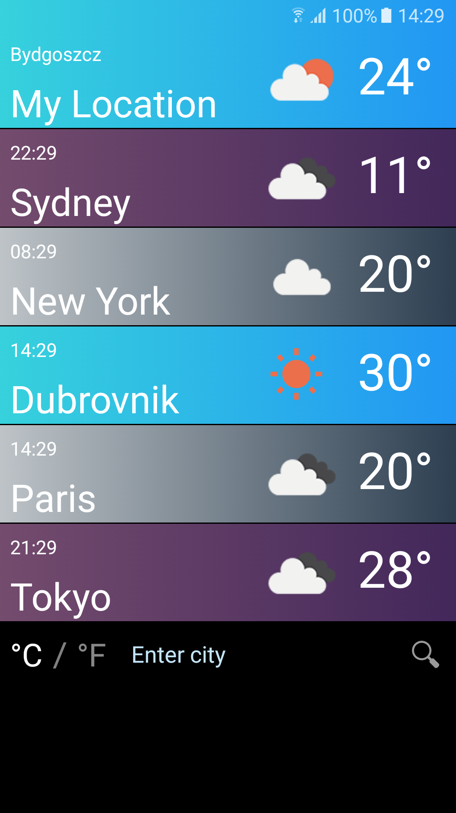
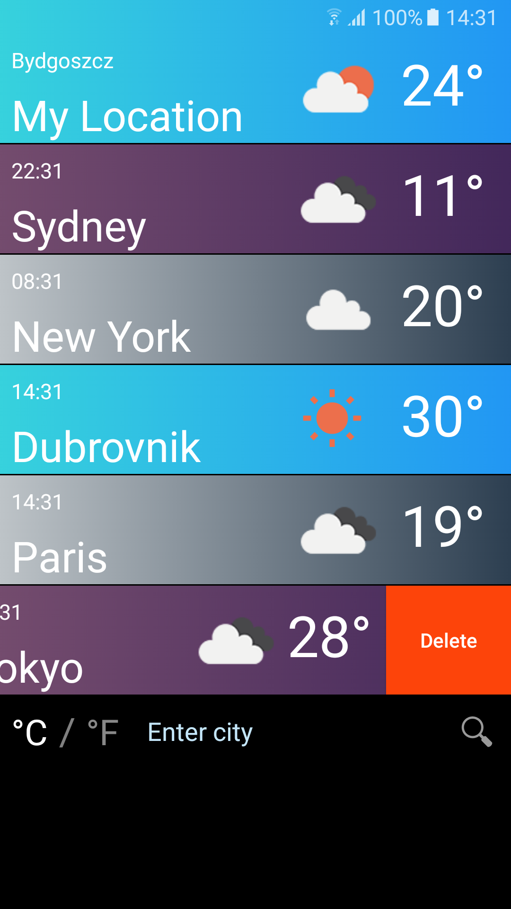

# Android Weather Application

Apple iPhone weather app clone for Android.

## Table of Contents

- [Descripition](#description)

- [Demo](#demo)

- [Download APK file](#download-apk-file)

- [Build guide](#build-guide)

- [Techonogies](#techonogies)

- [Permissions](#permissions)

- [UI description](#ui-description)

- [Comparison](#comparison)

- [Room for improvements](#room-for-improvements)

## Description

Weather application that is inspired by Apple Weather application. I wanted to create a project where I will be able to practise my Android dev skills. I had an idea to clone the iPhone Weather app because I could practise many aspects of app development. I managed to clone most of the iPhone app features. The biggest difference is in UI elements like icons or backgrounds images.

## Demo

 

## [Download APK file](weather-app-1.0.apk)

If apk file will download as zip file, rename .zip file to .apk file.

## Build guide

To build this project the best option is to use Android Studio.

1. Clone the repository.
2. Add the file with API credentials `project/apicredentials.properties` with the following text:

    ```properties
    key="..."
    ```

    To generate a key create a free account on [OpenWearher site](https://openweathermap.org).
3. Project is ready to be built

## Techonogies

It is a native application that has been made using:

- Android Studio
- Kotlin
- MVVM Architecture
- Hilt for dependency injection
- Retrofit for API calls
- Room for database connection

## Permissions

The application requires the following permissions:

- Network Access - is granted automatically

- Location - user has to give permission

## UI description

### Weather forecast activity

The main activity of the application. The activity contains current weather data, hourly forecast and daily forecast. In the right bottom corner of the screen is a button that takes users to city selection activity.

   

### City selection activity

The second activity of the application. Users can add or delete cities to the list and enter every city in the list to see more detailed information about the weather. The first item in the list is always user location. Other items have information about local time, current temperature and icon representing current weather. Under the cities is the item with the setting of units of measurement and location search box.

   

## Comparison

  

## Room for improvements

There is still a lot of things that can be improved:

- swiping between cities in weather forecast activity

- better background images

- percentage chance of rain

- better communication with the user if an error occurs

- more advanced system of the city search box

I want to add those features in the future.
